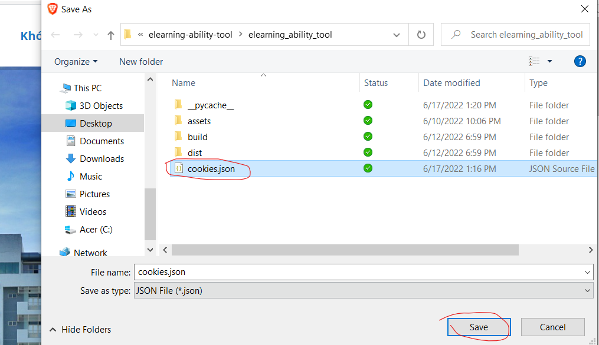

# elearning-ability-tool
Tool này dỏm lắm ><!
# Installer
- tải [src](https://github.com/trongtinh7727/elearning-ability-tool/releases/tag/v1.0) => giải nén
- hoặc dùng: `git clone https://github.com/trongtinh7727/elearning-ability-tool.git`
- Cài đặt các thư viện sau:
    - selenium: `pip install selenium`
    - tkinter: `pip install tk`
# Cookies login:
- Cài j2Cookies [tại đây](https://chrome.google.com/webstore/detail/j2team-cookies/okpidcojinmlaakglciglbpcpajaibco)
- Đăng nhập vào trang [elearning kỹ năng](https://elearning-ability.tdtu.edu.vn/Home)
- export cookies:
    
- Replace file `cookies.json` trong `./elearning_ability_tool/cookies.json`
    
# Run
- excute file \_\_init\_\_.py